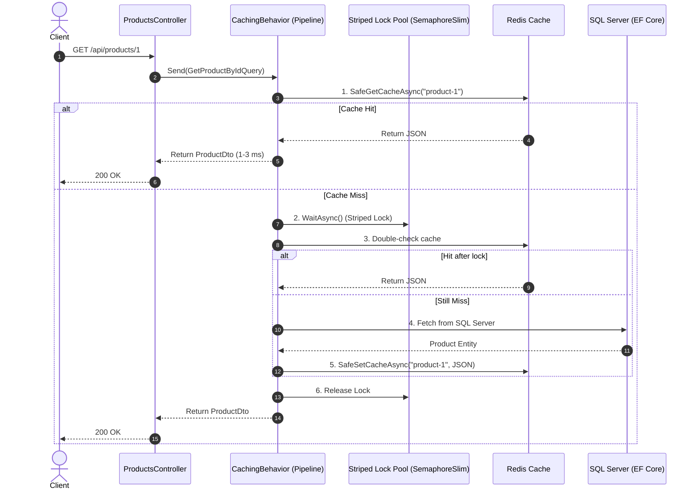

# 🚀 High-Performance Distributed Caching with Redis & MediatR in .NET 10

[](https://dotnet.microsoft.com/)
[](https://redis.io/)
[](https://github.com/jbogard/MediatR)
[](https://learn.microsoft.com/ef/)
[](LICENSE.txt)

A production-grade demonstration of **Distributed Caching (Redis)** and **CQRS (MediatR)** in **.NET 10**. This project demonstrates how to solve real-world caching challenges—such as **Cache Stampede (Thundering Herd)**, **Cache Penetration**, **Graceful Degradation (Fault Tolerance)**, and **Multi-Key Invalidation**—using clean architecture and MediatR pipeline behaviors.

---

## 🧠 Topics & Concepts Mastered in This Project

This project covers key distributed systems and caching patterns:

### 1. Transparent Caching with MediatR Pipeline Behaviors
* **Concept:** Instead of polluting business handlers with caching calls, caching is treated as a **cross-cutting concern**.
* **Implementation:** An `IPipelineBehavior<TRequest, TResponse>` intercepts any query implementing `ICacheableQuery<TResponse>`. Handlers remain 100% focused on database retrieval.

### 2. Cache Stampede (Thundering Herd) Prevention
* **Problem:** When a popular cache key expires, hundreds of concurrent requests simultaneously query the database, potentially crashing SQL Server.
* **Solution:** Implemented **Double-Checked Locking** using a **64-bucket Striped Lock (`SemaphoreSlim[]`)**.
* **Zero Memory Leak:** Instead of storing unbounded semaphores in a dictionary (which leaks RAM), a fixed striped pool provides high concurrency with zero memory growth over time.

### 3. Cache Penetration Defense (Null Object Caching)
* **Problem:** Repeated requests for non-existent IDs (e.g., `GET /api/products/999999`) bypass the cache and repeatedly hit the database.
* **Solution:** Negative lookups are cached using a sentinel token (`$$NULL_ENTRY$$`) with a short 30-second TTL. Subsequent queries for missing IDs short-circuit directly from Redis without hitting the DB.

### 4. Hybrid Expiration (Sliding + Absolute TTL)
* **Problem:** Sliding expiration alone can keep frequently accessed data in the cache indefinitely, serving stale data.
* **Solution:** Combined **Sliding Expiration** (e.g., 30 seconds) with an **Absolute Expiration ceiling** (e.g., 5 minutes) to guarantee periodic refresh.

### 5. Redis Resilience & Graceful Fallback (Fault Tolerance)
* **Problem:** In production, if Redis crashes or network timeouts occur, the application shouldn't return HTTP 500 errors.
* **Solution:** Safe cache wrappers (`SafeGetCacheAsync` / `SafeSetCacheAsync`) log warnings and gracefully fall back to querying the database directly. Zero user-facing downtime.

### 6. Multi-Key Invalidation Strategy
* **Problem:** Updating or deleting an entity must keep related collections in sync.
* **Solution:** Coordinated invalidation across:
  * Entity-level key: `product-{id}`
  * Collection-level key: `products-all`
  * Relational keys: `category-{catId}-products` (including old and new category keys if a product moves categories).

---

## 🏛️ Architecture & Request Flow



---

## 📂 Project Structure

```text
ProductsCacheDemo/
├── Common/
│   ├── Behaviors/
│   │   └── CachingBehavior.cs        # Pipeline behavior with locking, null-caching, & resilience
│   ├── Constants/
│   │   └── CacheKeys.cs              # Centralized, strongly-typed cache key generator
│   ├── Interfaces/
│   │   └── ICacheableQuery.cs        # Marker interface defining CacheKey and TTLs
│   └── Middlewares/
│       └── PerformanceLoggingMiddleware.cs # Request timing benchmark middleware
├── Controllers/
│   ├── CategoriesController.cs       # Category endpoints
│   └── ProductsController.cs         # Full CRUD product endpoints
├── Data/
│   ├── AppDbContext.cs               # EF Core DbContext
│   └── DbInitializer.cs              # Auto-seeds sample database records
├── Features/
│   ├── Categories/
│   │   └── Queries/                  # GetAllCategoriesQuery & Handler
│   └── Products/
│       ├── Commands/                 # CreateProduct, UpdateProduct, DeleteProduct
│       ├── Dtos/                     # Request and Response DTO records
│       └── Queries/                  # GetProductById, GetAllProducts, GetProductsByCategoryId
├── Program.cs                        # Service registration & middleware pipeline configuration
└── appsettings.json                  # Database and Redis connection strings
```

---

## 🛠️ Tech Stack

- **Platform:** [.NET 10](https://dotnet.microsoft.com/) (C# 13)
- **Database:** Microsoft SQL Server with [Entity Framework Core](https://learn.microsoft.com/ef/)
- **Distributed Cache:** [Redis](https://redis.io/) via `Microsoft.Extensions.Caching.StackExchangeRedis`
- **Architecture Pattern:** CQRS via [MediatR](https://github.com/jbogard/MediatR)
- **API Documentation:** Swagger / OpenAPI

---

## 🚦 API Endpoints

| HTTP Method | Route | Description | Cache Behavior |
| :--- | :--- | :--- | :--- |
| `GET` | `/api/products` | Get all products | Cached under `products-all` |
| `GET` | `/api/products/{id}` | Get product by ID | Cached under `product-{id}` (caches null if missing) |
| `GET` | `/api/products/category/{id}` | Get products by category | Cached under `category-{id}-products` |
| `POST` | `/api/products` | Create product | Evicts `category-{catId}-products` and `products-all` |
| `PUT` | `/api/products/{id}` | Update product | Evicts `product-{id}`, `products-all`, and affected category keys |
| `DELETE` | `/api/products/{id}` | Delete product | Evicts `product-{id}`, `products-all`, and `category-{catId}-products` |
| `GET` | `/api/categories` | Get all categories | Cached under `categories-all` |

---

## ⚡ Getting Started

### 1. Prerequisites
- [.NET 10 SDK](https://dotnet.microsoft.com/download)
- [Docker](https://www.docker.com/) (for Redis) or a local Redis server
- SQL Server (or LocalDB)

### 2. Start Redis
If using Docker:
```bash
docker run -d --name redis-cache -p 6379:6379 redis:alpine
```

### 3. Configure Connection Strings
In `appsettings.json`:
```json
{
  "ConnectionStrings": {
    "DefaultConnection": "Server=.;Database=ProductsCacheDb;Trusted_Connection=True;MultipleActiveResultSets=true;TrustServerCertificate=True",
    "Redis": "localhost:6379"
  }
}
```

### 4. Run the API
```bash
cd ProductsCacheDemo
dotnet run
```
The database will automatically initialize and seed sample categories and products on first run.

Access Swagger UI at: `https://localhost:<port>/swagger`

---

## 🧪 How to Verify in the Console

### Benchmark Cache Hits vs. Misses
1. Call `GET /api/products/1`:
   - Console logs: `---> [REDIS CACHE MISS - Fetching from DB]`
   - Performance: `~30-50 ms`
2. Call `GET /api/products/1` again:
   - Console logs: `---> [REDIS CACHE HIT] Key: 'product-1'`
   - Performance: `~1-3 ms`

### Test Stampede Protection (50 Parallel Requests)
Run in PowerShell:
```powershell
1..50 | ForEach-Object -Parallel {
    Invoke-RestMethod -Uri "http://localhost:5069/api/products/1"
} -ThrottleLimit 50
```
**Result in Console:**
- Exactly **one** DB fetch is triggered.
- Remaining 49 requests wait for the lock and immediately register as `[REDIS CACHE HIT (After Lock)]`.

### Test Redis Resilience
1. Stop your Redis instance (`docker stop redis-cache`).
2. Call `GET /api/products/1`.
3. **Result:** The system logs a `[REDIS CACHE UNAVAILABLE]` warning and returns data directly from SQL Server with **HTTP 200 OK** (zero 500 crashes).